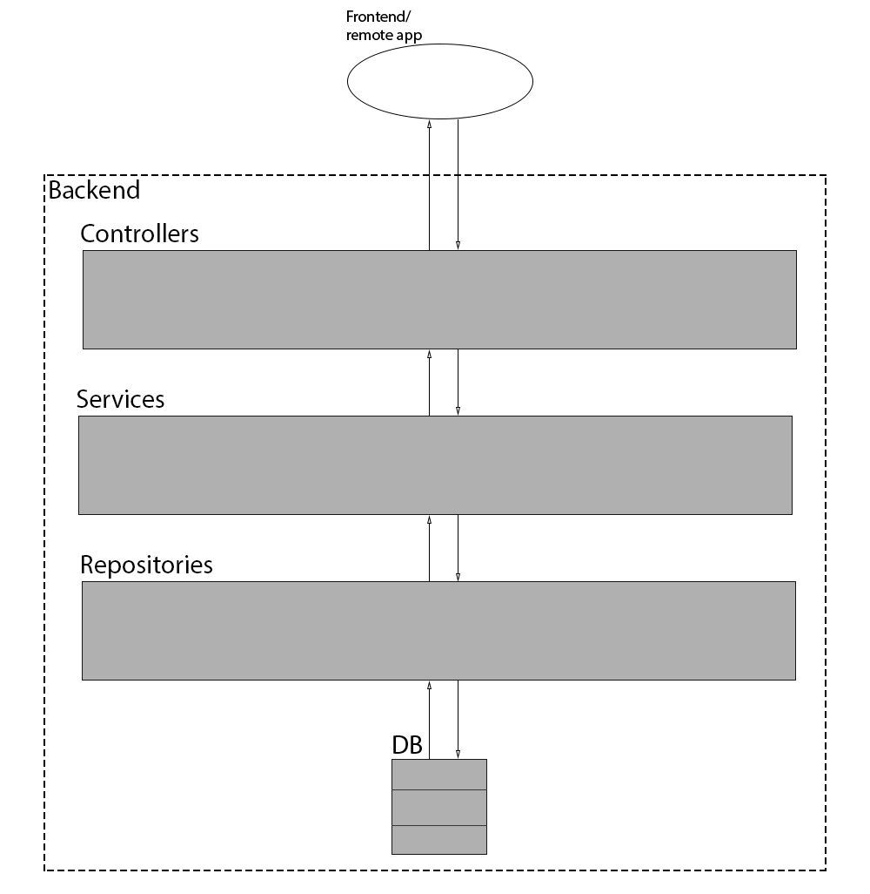
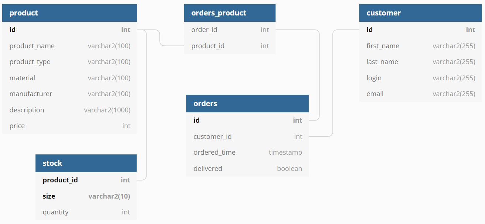
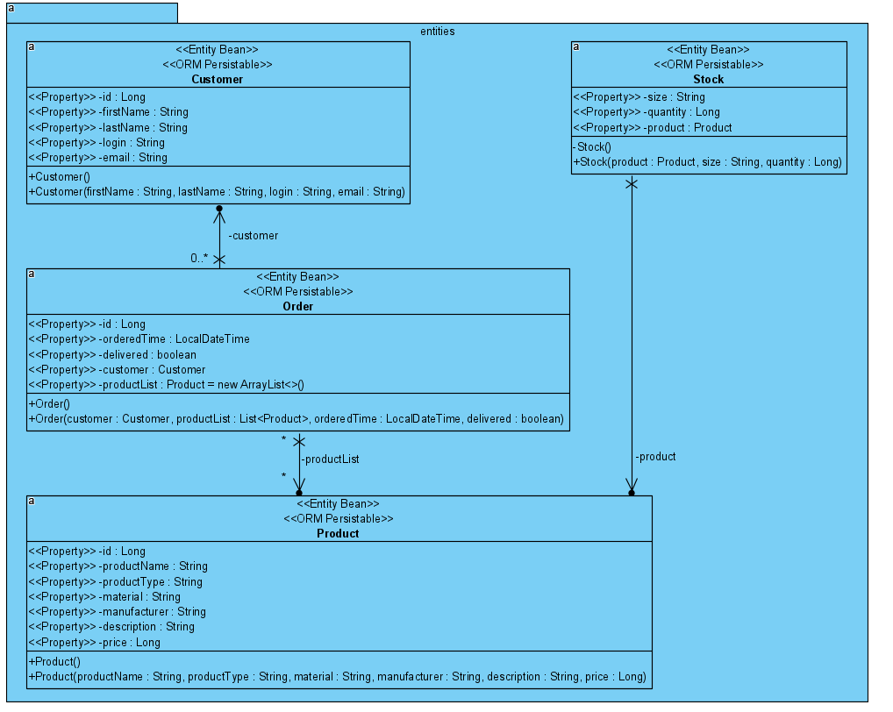

# Введение

## Что это?

shop-app-backend — мой pet-project, представляющий собой backend-часть интернет-магазина одежды.

## А зачем?

<ul>
<li>Для получения опыта <s>какой-никакой</s> энтерпрайз-разработки;</li>
<li>Для изучения инструментов и технологий в рамках уже существующего решения;</li>
<li>Для возможности иметь проект, 
    с которым можно проводить любые манипуляции и не иметь проблем с совестью;</li>
<li><s>Для включения в резюме.</s></li>
</ul>

## Концепция

За основу взята идея создания интернет-магазина одежды. Функционал приложения должен позволять:
<ul>
<li>получать информацию о текущем ассортименте магазина;</li>
<li>формировать заказы на покупку;</li>
<li>управлять складскими запасами ассортимента.</li>
</ul>

# Как попробовать?

## Образ Docker

Репозиторий с образом приложения: `nikjag/shop-app-backend`. 

Чтобы создать контейнер: `docker run -dp 8080:8080 --name shop-app-backend nikjag/shop-app-backend`.

## Архив

Архив с собранным проектом [здесь](https://github.com/nikjags/Shop-app-backend/releases/latest). Для запуска нужна Java версии 8 и выше.

В файле со скачанным проектом открыть командную строку и ввести `java -jar название_архива`.

Остановка работы приложения:
<ul>
<li>Для сторонников светлой силы: вбить в браузер 
    <code>http://localhost:8080/shop/api/app/shutdown</code>;</li>
<li>Для тех, кому дорого время: закрыть окно консоли с приложением.</li>
</ul>

# Внутренности backend-проекта

Backend-часть представляет собой небольшое приложение, созданное на Spring Boot, основной целью которого является обработка запросов на получение, сохранение и
удаление данных.

## Устройство бэкенда

Общая схема приложения:

### Repositories

Отвечают за доступ к БД и реализуют базовые CRUD-операции. Является поставщиком функционала для сервисов.

У каждой ORM-сущности (см. ниже) собственный репозиторий.

Код репозиториев расположен в `src/main/java/ru/study/shop/adapters/hibernate`.

### Services

Являются промежуточным уровнем между БД и потребителями данных. Предоставляют основной функционал для доступа к данным внутри бэкенда. Расширяют функционал
работы с БД; методы сервисов отвечают за выполнение и откат транзакций.

Каждый сервис отвечает за доступ к данным одной сущности. Например, `OrderService` предоставляет методы для работы с сущностью Order.

Код интерфейсов расположен в `src/main/java/ru/study/shop/services/interfaces`, имплементаций: `src/main/java/ru/study/shop/services/impl`.

### Controllers

Связывают backend-часть с frontend-частью или сторонними приложениями. Предоставляют API для доступа к данным извне.

В данный момент предоставляемый API не является RESTful, по сути своей является RPC
(подробности [здесь](https://roy.gbiv.com/untangled/2008/rest-apis-must-be-hypertext-driven)).

Код контроллеров расположен в `src/main/java/ru/study/shop/adapters/controllers`.

## Схема базы данных

Схема БД:

|   Отношение    |                                 Описание                                 |
| -------------- | ------------------------------------------------------------------------ |
| product        | Содержит данные о всём ассортименте магазина;                            |
| order          | Содержит данные о всех заказах, совершённых в магазине;                  |
| orders_product | Промежуточная таблица, содержащая все заказанные товары и их количество; |
| stock          | Содержит даннные о текущих запасах в магазине;                           |
| customer       | Содержит информацию о покупателях;                                       |

Простая таблица, удовлетворяющая потребности в хранении данных внутри приложения.

В качестве БД для хранения данных выбрана H2 -- опенсорсная in-memory БД с возможностью доступа через консоль в браузере.

Наполнение БД производится через flyway -- систему контроля версий для баз данных. Скрипты миграции расположены в `src/main/resources/db/migration`.

## Схема ORM-сущностей

В качестве ORM-фреймворка используется Hibernate.

Схема сущностей:

Нужно отметить, что в проекте в качестве первичного ключа для класса `Stock` используется не суррогатный ключ, а составной ключ с полями `Product` и `Size`; для
этих целей был создан класс `StockId` (требование JPA).

# P.S.

А frontend будет ближе к выходным.